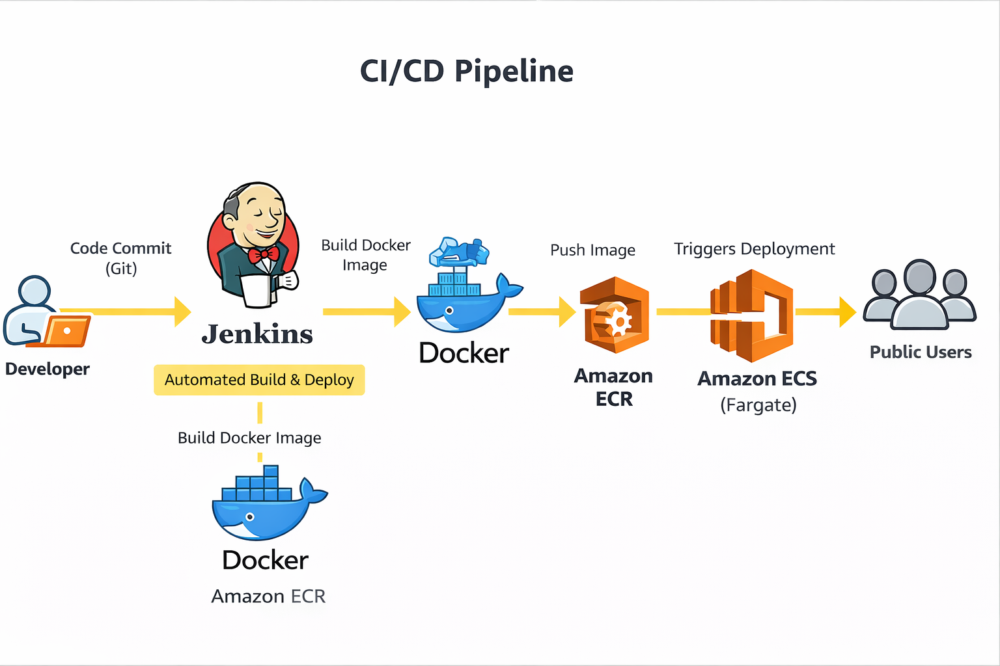

# CI/CD Pipeline with Jenkins, Docker, Amazon ECR & ECS (Fargate)

## 📌 Overview

This project demonstrates a complete end-to-end CI/CD pipeline for deploying a containerized web application on AWS.

The pipeline automates:
- Building a Docker image using Jenkins
- Pushing the image to Amazon ECR
- Deploying the application to Amazon ECS (Fargate)

The deployed application is publicly accessible via a public IP.

---

## 🏗️ Architecture



## 🔄 Request Flow

1. Developer updates application code
2. Jenkins pipeline is triggered manually
3. Jenkins builds a Docker image
4. Jenkins authenticates with Amazon ECR
5. Image is tagged and pushed to ECR
6. ECS service is updated
7. ECS pulls latest image from ECR
8. ECS runs container on Fargate
9. Application becomes accessible via public IP

---

## 💻 Tech Stack

- AWS EC2
- Jenkins
- Docker
- Amazon ECR
- Amazon ECS (Fargate)
- AWS CLI
- Ubuntu Linux

---

# ⚙️ Step-by-Step Implementation

---

## 🔹 1. Launch EC2 Instance

- Instance type: t3.medium
- OS: Ubuntu
- Open ports:
  - 22 (SSH)
  - 8080 (Jenkins)
  - 80 (HTTP)

Connect:
```bash
ssh -i key.pem ubuntu@<PUBLIC-IP>
```

## 🔹 2. Install Java
```bash
sudo apt update
sudo apt install openjdk-17-jdk -y
```
## 🔹 3. Install Jenkins
```bash
wget https://get.jenkins.io/debian-stable/jenkins_2.492.3_all.deb
sudo apt install -y ./jenkins_2.492.3_all.deb
```
Start Jenkins:
```bash
sudo systemctl start jenkins
sudo systemctl enable jenkins
```

Access:
```bash
http://<PUBLIC-IP>:8080
```

## 🔹 4. Install Docker
```bash
sudo apt install docker.io -y
sudo systemctl start docker
sudo systemctl enable docker
```
Grant permissions:
```bash
sudo usermod -aG docker jenkins
sudo usermod -aG docker ubuntu
newgrp docker
```

Test:
```bash
docker run hello-world
```

## 🔹 5. Create Application
Dockerfile
```bash
FROM nginx:latest
COPY . /usr/share/nginx/html
```
index.html
```bash
<h1>Hello from Jenkins </h1>
<p>Deployed via CI/CD Pipeline on AWS (ECR + ECS)</p>
```
## 🔹 6. Create Jenkins Pipeline
Pipeline stages:
	•	Build Docker image
	•	Login to ECR
	•	Tag image
	•	Push image
	•	Deploy to ECS

## 🔹 7. Create ECR Repository
	•	Name: html-website
	•	Copy repository URI

Example:
```bash
<ACCOUNT_ID>.dkr.ecr.us-east-1.amazonaws.com/html-website
```

## 🔹 8. Install AWS CLI
```bash
curl "https://awscli.amazonaws.com/awscli-exe-linux-x86_64.zip" -o "awscliv2.zip"
unzip awscliv2.zip
sudo ./aws/install
```

## 🔹 9. Configure IAM Role
Attach this policy to EC2:
```bash
AmazonEC2ContainerRegistryFullAccess
```
## 🔹 10. Push Docker Image to ECR
Login:
```bash
aws ecr get-login-password --region us-east-1 | \
docker login --username AWS --password-stdin <ECR_URI>
```
Tag:
```bash
docker tag html-website:latest <ECR_URI>:latest
```
Push:
```bash
docker push <ECR_URI>:latest
```

## 🔹 11. Setup ECS (Fargate)
**Create Cluster**  
	•	html-website-cluster

**Create Task Definition**  
	•	html-website-task  
	•	CPU: 0.25 vCPU  
	•	Memory: 0.5 GB  
	•	Port: 80  

**Create Service**  
	•	Desired tasks: 1  
	•	Public IP: ENABLED  
	•	Subnets: Public  
	•	Security Group: Allow HTTP (80)

## 🔹 12. Access Application
```bash
http://<ECS-PUBLIC-IP>
```

# ✅ Working Application


## 12. Access Application
❌ **Jenkins Installation Failure**  
**Issue:** GPG errors on Ubuntu  
**Solution:** Installed using .deb package  


❌ **Plugin Installation Failure**  
**Issue:** Version mismatch  
**Solution:** Upgraded Jenkins version

❌ **Docker Permission Error**


  
```bash
permission denied while connecting to docker daemon
```
Solution:
```bash
sudo usermod -aG docker ubuntu
newgrp docker
```

## 📬 Contact  
If you’re a recruiter or hiring manager looking for a Cloud/DevOps Engineer, feel free to connect via email at samuel.tfio@gmail.com

## 🔗 Links

[](https://www.linkedin.com/in/samuel-tettey-fio/)


## Authors

- [@bigsam233](https://www.github.com/bigsam233)


